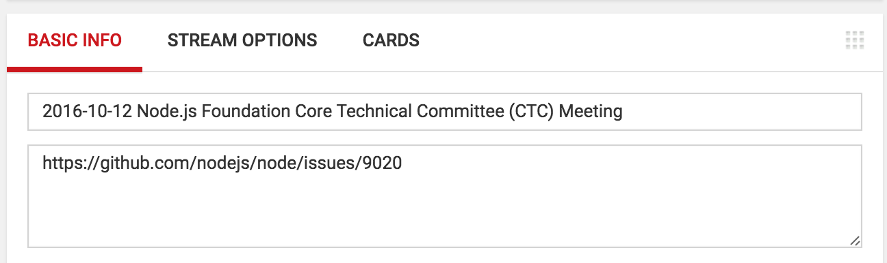
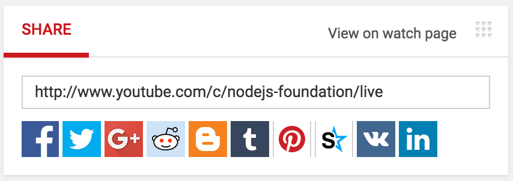
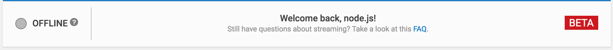
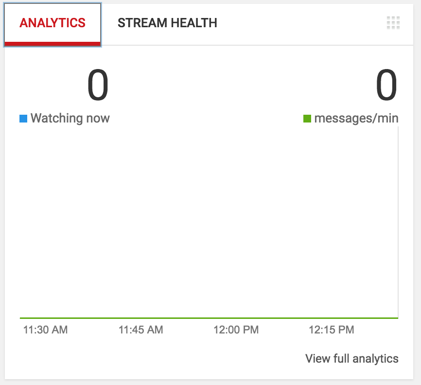

# 将会议直播到 YouTube

我们使用 [Zoom](https://zoom.us/) 将会议公开直播到 YouTube。

## 获取访问权限

你需要 Foundation 的 Zoom 登录凭据才能主持会议。
用户名和密码通过 1password 共享。

你的 YouTube 账号必须是
[Node.js YouTube 账号](https://www.youtube.com/channel/UCQPYJluYC_sn_Qz_XE-YbTQ) 的管理员。

要申请访问权限，请在 Node.js
[admin](https://github.com/nodejs/admin) 仓库中创建一个 issue，标题为
`Zoom and Youtube access for X`，其中 X 是申请访问权限的人的 GitHub id 和
YouTube ID。
请附上简短的申请原因（例如直播团队会议等）。

除非有人提出反对，否则该申请在 48 小时后视为已批准。

## 管理访问权限

### Youtube

要添加管理员或验证某个账号是否为管理员：

1. 访问 <https://youtube.com>
2. 点击右上角的 Node.js 图标。
3. 选择设置，选择“添加或移除管理员”，选择“管理权限”
4. 在该页面中，你可以使用弹出窗口右上角的 +people 来添加
   人员。这里也会列出所有当前管理员。

### Zoom

要共享 Zoom 密码，请登录 1password，选择
`zoom-creds` vault 的设置齿轮，然后使用 `Share Vault` 与
新用户共享该 vault。使用齿轮将权限设置为仅包含 `View Items` 和
`View and Copy passwords`。

在为用户添加访问权限时，也请他们创建一个 PR，将自己添加到
[iojs.org/aliases.json](https://github.com/nodejs/email/blob/main/iojs.org/aliases.json)
文件中的 `zoom-nodejs` 组里 [nodejs/email](https://github.com/nodejs/email/)

## 直播会议

### 开始和停止直播

1. 使用 Foundation 凭据登录 <https://zoom.us>。
2. 访问 <https://zoom.us/webinar/list>，找到会议。
3. 点击 "Start"，它应会在 Zoom 应用中打开会议。
4. 进入 "Participants" 面板，勾选 Attendees，将他们提升为 panelists。
5. 在工具栏中点击 "... More"，选择 "Live on YouTube"，它会在
   浏览器中打开。
6. 选择使用 Node.js 账号登录 <https://youtube.com>，接受
   Zoom 使用协议（首次使用时）
7. 在 Streaming 页面，编辑 webinar 标题以包含会议日期，
   然后点击红色的 "Go Live!" 按钮。故障排查提示：至少有一位
   人发现 "Go Live!" 报错，提示 "Please grant
   necessary privilege for live streaming"。将链接从默认
   浏览器复制到另一个浏览器可能可以绕过此问题。

每位参与者都可以选择是否开启视频参与。

YouTube 会记录直播。录制内容会发布在
[Node.js 频道](https://www.youtube.com/channel/UCQPYJluYC_sn_Qz_XE-YbTQ/videos)。

直播标题会根据 Zoom 中的信息自动设置。我们通常将其设置为
`YYYY-MM-DD - Meeting Name`，例如
`2022-11-02 - Technical Steering Community Meeting`。

描述应为会议 issue 的链接。

如果需要，你之后也可以在 YouTube 上编辑标题和描述。



### 直播开始后分享会议

会议链接应为 `http://www.youtube.com/c/nodejs-foundation/live`。

将其发送到推文中，例如：

```text
.@nodejs Technical Steering Committee meeting live now:
http://www.youtube.com/c/nodejs-foundation/live
```

根据需要调整 `Technical Steering Committee` 部分，如果是从官方 twitter 账号发推，
则删除 `.@nodejs`。



## 检查直播状态

直播时这里应显示 online，通常会是绿色。

不过，它可能会变成黄色，并在下方的 "stream health"
部分给出警告。由于我们通常使用静态图片作为
视频，常会出现视频比特率过低的警告。
这不是问题，几乎总是可以忽略。



## 查看有多少人在观看



## 管理聊天并收集问题

聊天管理遵循 [Moderation Policy](https://github.com/nodejs/admin/blob/main/Moderation-Policy.md)。
可以通过右键单击消息并选择所需操作来进行管理，
例如 `remove`。

如果你以 Node.js 身份参与聊天，最好
在消息末尾附上你的姓名首字母。
