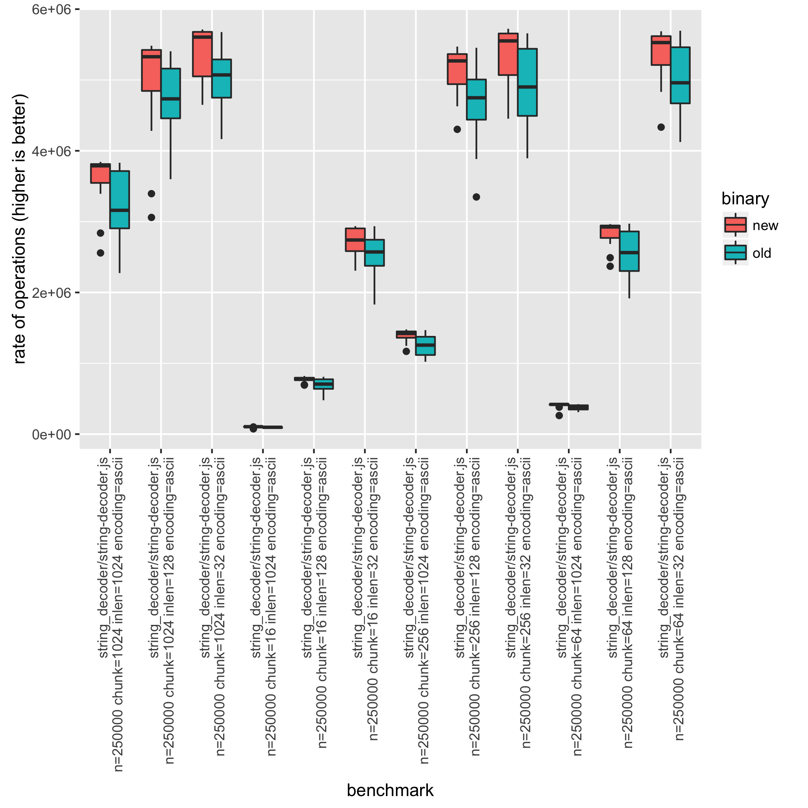
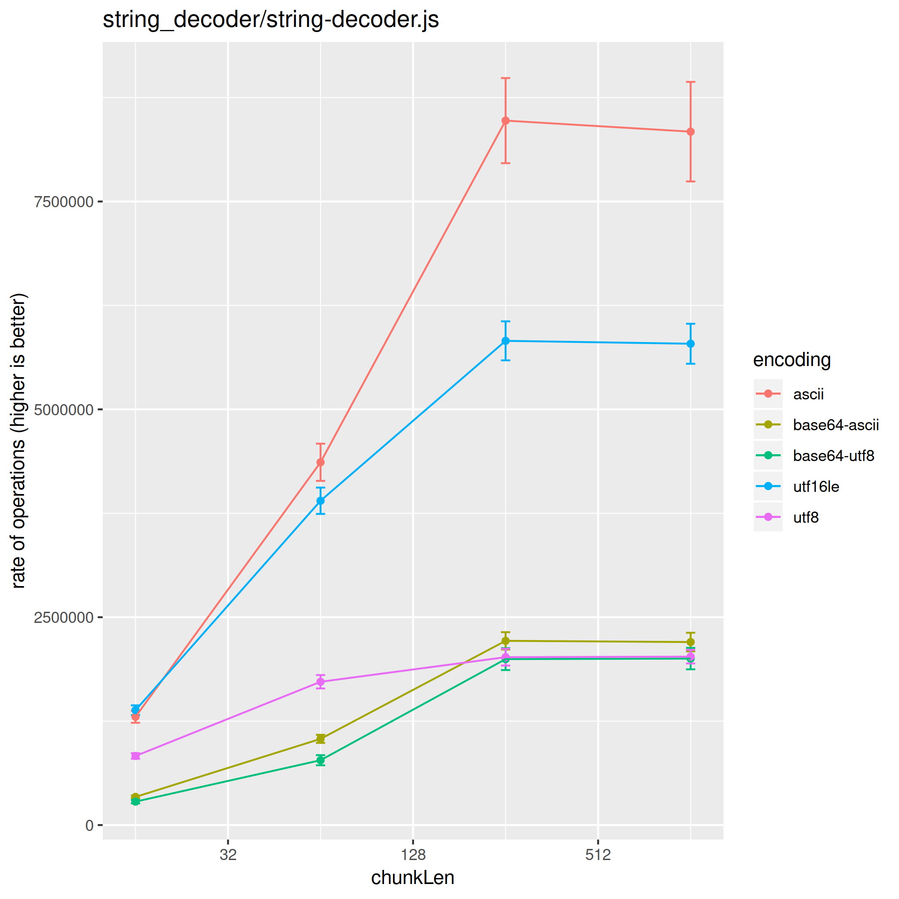

# 如何在 Node.js core 中编写并运行基准测试

## 目录

* [前置条件](#prerequisites)
  * [HTTP 基准测试要求](#http-benchmark-requirements)
  * [HTTPS 基准测试要求](#https-benchmark-requirements)
  * [HTTP/2 基准测试要求](#http2-benchmark-requirements)
  * [基准分析要求](#benchmark-analysis-requirements)
* [运行基准测试](#running-benchmarks)
  * [运行单个基准测试](#running-individual-benchmarks)
  * [使用 calibrate-n.js 校准迭代次数](#calibrating-the-number-of-iterations-with-calibrate-njs)
  * [运行所有基准测试](#running-all-benchmarks)
  * [使用 run.js 指定基准测试的 CPU 核心](#specifying-cpu-cores-for-benchmarks-with-runjs)
  * [过滤基准测试](#filtering-benchmarks)
  * [比较 Node.js 版本](#comparing-nodejs-versions)
  * [比较参数](#comparing-parameters)
  * [在 CI 上运行基准测试](#running-benchmarks-on-the-ci)
* [创建基准测试](#creating-a-benchmark)
  * [基准测试基础](#basics-of-a-benchmark)
  * [创建 HTTP 基准测试](#creating-an-http-benchmark)

## 前置条件

某些基准测试需要基本的 Unix 工具。
[Git for Windows][git-for-windows] 包含 Git Bash 和必要的工具，
这些工具需要包含在全局 Windows `PATH` 中。

如果你使用的是 Nix，所需工具都已经列在
`shell.nix` 文件的 `benchmarkTools` 参数中，因此可以跳过这些
前置条件。

### HTTP 基准测试要求

大多数 HTTP 基准测试都需要安装一个基准压测工具。它可以是
[`wrk`][wrk] 或 [`autocannon`][autocannon]。

`Autocannon` 是一个 Node.js 脚本，可以通过
`npm install -g autocannon` 安装。它会使用 `path` 中的
Node.js 可执行文件。为了比较两次 HTTP 基准测试运行结果，请确保
`path` 中的 Node.js 版本没有被更改。

`wrk` 可能可以通过某个可用的包管理器安装。如果不行，
也可以很容易地通过 [从源码构建][wrk] 使用 `make` 来编译。

默认情况下会使用 `wrk` 作为基准压测工具。如果它不可用，
则会改用 `autocannon`。在创建 HTTP 基准测试时，
应通过参数显式指定所使用的基准压测工具：

```bash
node benchmark/run.js --set benchmarker=autocannon http
node benchmark/http/simple.js benchmarker=autocannon
```

#### HTTPS 基准测试要求

要运行 `https` 基准测试，必须使用 `autocannon` 或 `wrk`
作为基准压测工具之一。

```bash
node benchmark/https/simple.js benchmarker=autocannon
```

#### HTTP/2 基准测试要求

要运行 `http2` 基准测试，必须使用 `h2load` 基准压测工具。
`h2load` 工具是 `nghttp2` 项目的一个组件，可以从
[nghttp2.org][] 安装，或者从源码构建。

```bash
node benchmark/http2/simple.js benchmarker=h2load
```

### 基准分析要求

要对结果进行统计分析，你可以使用
[node-benchmark-compare][] 工具或 R 脚本 `benchmark/compare.R`。

[node-benchmark-compare][] 是一个 Node.js 脚本，可以通过
`npm install -g node-benchmark-compare` 安装。

要在分析结果时绘制对比图，需要安装 `R`。
可以使用可用的包管理器安装，或者从
<https://www.r-project.org/> 下载。

还会用到 R 包 `ggplot2` 和 `plyr`，可以在
R REPL 中安装。

```console
$ R
install.packages("ggplot2")
install.packages("plyr")
```

如果提示需要先选择 CRAN 镜像，请使用 `repo`
参数指定镜像。

```r
install.packages("ggplot2", repo="http://cran.us.r-project.org")
```

当然，请根据所在地使用合适的镜像。
镜像列表可 [在此处找到](https://cran.r-project.org/mirrors.html)。

## 运行基准测试

### 将 CPU 频率调节器设置为 "performance"

建议在运行基准测试之前将 CPU 频率设置为 `performance`。
这会提高每个基准测试根据硬件达到峰值性能的可能性。
因此，请运行：

```console
$ ./benchmark/cpu.sh fast
```

### 运行单个基准测试

这对于调试基准测试或进行快速性能测量很有用。但它不提供
用于得出性能结论的统计信息。

可以直接使用 node 执行单个基准测试脚本。

```console
$ node benchmark/buffers/buffer-tostring.js

buffers/buffer-tostring.js n=10000000 len=0 arg=true: 62710590.393305704
buffers/buffer-tostring.js n=10000000 len=1 arg=true: 9178624.591787899
buffers/buffer-tostring.js n=10000000 len=64 arg=true: 7658962.8891432695
buffers/buffer-tostring.js n=10000000 len=1024 arg=true: 4136904.4060201733
buffers/buffer-tostring.js n=10000000 len=0 arg=false: 22974354.231509723
buffers/buffer-tostring.js n=10000000 len=1 arg=false: 11485945.656765845
buffers/buffer-tostring.js n=10000000 len=64 arg=false: 8718280.70650129
buffers/buffer-tostring.js n=10000000 len=1024 arg=false: 4103857.0726124765
```

每一行代表一个单独的基准测试，参数以
`${variable}=${value}` 的形式指定。每种配置组合都会在单独的
进程中执行。这样可以确保基准测试结果不会因为 V8 优化带来的
执行顺序而受到影响。**最后一个数字是以 ops/sec
衡量的操作速率（越高越好）。**

此外，也可以通过在进程参数中设置它们来指定配置的子集：

```console
$ node benchmark/buffers/buffer-tostring.js len=1024

buffers/buffer-tostring.js n=10000000 len=1024 arg=true: 3498295.68561504
buffers/buffer-tostring.js n=10000000 len=1024 arg=false: 3783071.1678948295
```

### 使用 calibrate-n.js 校准迭代次数

在运行基准测试之前，通常有必要确定能提供统计稳定结果的最佳迭代次数 (`n`)。
`calibrate-n.js` 工具通过以逐渐增大的 `n` 值多次运行基准测试，直到变异系数 (CV)
低于目标阈值，从而帮助找到这个值。

```console
$ node benchmark/calibrate-n.js benchmark/buffers/buffer-compare.js

--------------------------------------------------------
Benchmark: buffers/buffer-compare.js
--------------------------------------------------------
What we are trying to find: The optimal number of iterations (n)
that produces consistent benchmark results without wasting time.

How it works:
1. Run the benchmark multiple times with a specific n value
2. Group results by configuration
3. If overall CV is above 5% or any configuration has CV above 10%, increase n and try again
4. Stop when we have stable results (overall CV < 5% and all configs CV < 10%) or max increases reached

Configuration:
- Starting n: 10 iterations
- Runs per n value: 30
- Target CV threshold: 5% (lower CV = more stable results)
- Max increases: 6
- Increase factor: 10x
```

该工具接受以下选项：

* `--runs=N`：每个 n 值的运行次数（默认：30）
* `--cv-threshold=N`：目标变异系数阈值（默认：0.05）
* `--max-increases=N`：要尝试的最大 n 增加次数（默认：6）
* `--start-n=N`：起始 n 值（默认：10）
* `--increase=N`：每次增加 n 的倍数（默认：10）

一旦确定了稳定的 `n` 值，就可以在运行基准测试时使用它。

### 运行所有基准测试

与运行单个基准测试类似，可以使用 `run.js` 工具执行一组基准测试。
要查看如何使用此脚本，请运行 `node benchmark/run.js`。同样，这并不提供
用于得出结论的统计信息。

```console
$ node benchmark/run.js assert

assert/deepequal-buffer.js
assert/deepequal-buffer.js method="deepEqual" strict=0 len=100 n=20000: 773,200.4995493788
assert/deepequal-buffer.js method="notDeepEqual" strict=0 len=100 n=20000: 964,411.712953848
...

assert/deepequal-map.js
assert/deepequal-map.js method="deepEqual_primitiveOnly" strict=0 len=500 n=500: 20,445.06368453332
assert/deepequal-map.js method="deepEqual_objectOnly" strict=0 len=500 n=500: 1,393.3481642240833
...

assert/deepequal-object.js
assert/deepequal-object.js method="deepEqual" strict=0 size=100 n=5000: 1,053.1950937538475
assert/deepequal-object.js method="notDeepEqual" strict=0 size=100 n=5000: 9,734.193251965213
...
```

可以通过添加额外的进程参数来执行更多分组。

```bash
node benchmark/run.js assert async_hooks
```

也可以使用 `--runs` 标志多次执行基准测试。

```bash
node benchmark/run.js --runs 10 assert async_hooks
```

该命令将把 `benchmark/assert` 和 `benchmark/async_hooks` 中的基准测试文件
各运行 10 次。

#### 使用 run.js 指定基准测试的 CPU 核心

当使用 `run.js` 执行一组基准测试时，
你可以使用 `--set CPUSET=value` 选项指定
基准测试应运行在哪些 CPU 核心上。
这会控制基准测试进程的 CPU 核心
亲和性，从而有可能减少
来自其他进程的干扰，并允许
在特定硬件配置下进行
性能测试。

`CPUSET` 选项使用 `taskset` 命令的格式
来设置 CPU 亲和性，其中 `value` 可以是单个核心
编号或一个核心范围。

示例：

* `node benchmark/run.js --set CPUSET=0` ... 在 CPU 核心 0 上运行基准测试。
* `node benchmark/run.js --set CPUSET=0-2` ...
  指定基准测试应在 CPU 核心 0 到 2 上运行。

注意：此选项仅适用于使用 `run.js` 时。
请确保系统上可用 `taskset` 命令，
并且指定的 `CPUSET` 格式符合其要求。

#### 过滤基准测试

`benchmark/run.js` 和 `benchmark/compare.js` 提供了 `--filter pattern` 和
`--exclude pattern` 选项，可分别用于运行基准测试的子集或
排除特定基准测试。

```console
$ node benchmark/run.js --filter "deepequal-b" assert

assert/deepequal-buffer.js
assert/deepequal-buffer.js method="deepEqual" strict=0 len=100 n=20000: 773,200.4995493788
assert/deepequal-buffer.js method="notDeepEqual" strict=0 len=100 n=20000: 964,411.712953848

$ node benchmark/run.js --exclude "deepequal-b" assert

assert/deepequal-map.js
assert/deepequal-map.js method="deepEqual_primitiveOnly" strict=0 len=500 n=500: 20,445.06368453332
assert/deepequal-map.js method="deepEqual_objectOnly" strict=0 len=500 n=500: 1,393.3481642240833
...

assert/deepequal-object.js
assert/deepequal-object.js method="deepEqual" strict=0 size=100 n=5000: 1,053.1950937538475
assert/deepequal-object.js method="notDeepEqual" strict=0 size=100 n=5000: 9,734.193251965213
...
```

`--filter` 和 `--exclude` 可以重复使用，以提供多个模式。

```console
$ node benchmark/run.js --filter "deepequal-b" --filter "deepequal-m" assert

assert/deepequal-buffer.js
assert/deepequal-buffer.js method="deepEqual" strict=0 len=100 n=20000: 773,200.4995493788
assert/deepequal-buffer.js method="notDeepEqual" strict=0 len=100 n=20000: 964,411.712953848

assert/deepequal-map.js
assert/deepequal-map.js method="deepEqual_primitiveOnly" strict=0 len=500 n=500: 20,445.06368453332
assert/deepequal-map.js method="deepEqual_objectOnly" strict=0 len=500 n=500: 1,393.3481642240833

$ node benchmark/run.js --exclude "deepequal-b" --exclude "deepequal-m" assert

assert/deepequal-object.js
assert/deepequal-object.js method="deepEqual" strict=0 size=100 n=5000: 1,053.1950937538475
assert/deepequal-object.js method="notDeepEqual" strict=0 size=100 n=5000: 9,734.193251965213
...

assert/deepequal-prims-and-objs-big-array-set.js
assert/deepequal-prims-and-objs-big-array-set.js method="deepEqual_Array" strict=0 len=20000 n=25 primitive="string": 865.2977195251661
assert/deepequal-prims-and-objs-big-array-set.js method="notDeepEqual_Array" strict=0 len=20000 n=25 primitive="string": 827.8297281403861
assert/deepequal-prims-and-objs-big-array-set.js method="deepEqual_Set" strict=0 len=20000 n=25 primitive="string": 28,826.618268696366
...
```

如果 `--filter` 和 `--exclude` 同时使用，`--filter` 会先应用，
然后在 `--filter` 的结果上应用 `--exclude`：

```console
$ node benchmark/run.js --filter "bench-" process

process/bench-env.js
process/bench-env.js operation="get" n=1000000: 2,356,946.0770617095
process/bench-env.js operation="set" n=1000000: 1,295,176.3266261867
process/bench-env.js operation="enumerate" n=1000000: 24,592.32231990992
process/bench-env.js operation="query" n=1000000: 3,625,787.2150573144
process/bench-env.js operation="delete" n=1000000: 1,521,131.5742806569

process/bench-hrtime.js
process/bench-hrtime.js type="raw" n=1000000: 13,178,002.113936031
process/bench-hrtime.js type="diff" n=1000000: 11,585,435.712423025
process/bench-hrtime.js type="bigint" n=1000000: 13,342,884.703919787

$ node benchmark/run.js --filter "bench-" --exclude "hrtime" process

process/bench-env.js
process/bench-env.js operation="get" n=1000000: 2,356,946.0770617095
process/bench-env.js operation="set" n=1000000: 1,295,176.3266261867
process/bench-env.js operation="enumerate" n=1000000: 24,592.32231990992
process/bench-env.js operation="query" n=1000000: 3,625,787.2150573144
process/bench-env.js operation="delete" n=1000000: 1,521,131.5742806569
```

#### 基准测试分组

基准测试也可以包含分组，使开发者在区分测试用例时拥有更大的灵活性，
同时也有助于缩短组合基准参数的运行时间。

默认情况下，运行基准测试时会执行所有分组。
不过，在运行 `compare.js` 时，可以通过设置
`NODE_RUN_BENCHMARK_GROUPS` 环境变量来指定单独的分组：

```bash
NODE_RUN_BENCHMARK_GROUPS=fewHeaders,manyHeaders node http/headers.js
```

### 比较 Node.js 版本

要比较新 Node.js 版本带来的影响，请使用 `compare.js` 工具。它会
将每个基准测试运行多次，从而可以计算
性能指标的统计信息。要查看如何使用此脚本，
请运行 `node benchmark/compare.js`。

举例来说，为了检查某个潜在的性能改进，
将使用 [#5134](https://github.com/nodejs/node/pull/5134) 拉取请求作为
示例。这个拉取请求声称可以提升
`node:string_decoder` 模块的性能。

首先构建两个 Node.js 版本，一个来自 `main` 分支（这里称为
`./node-main`），另一个应用了该拉取请求（这里称为
`./node-pr-5134`）。

要并行运行多个已编译版本，你需要复制构建输出：
`cp ./out/Release/node ./node-main`。请参考以下示例：

```bash
git checkout main
./configure && make -j4
cp ./out/Release/node ./node-main

git checkout pr-5134
./configure && make -j4
cp ./out/Release/node ./node-pr-5134
```

然后 `compare.js` 工具会生成一个包含基准测试结果的 csv 文件。

```bash
node benchmark/compare.js --old ./node-main --new ./node-pr-5134 string_decoder > compare-pr-5134.csv
```

_提示：`benchmark/compare.js` 有一些有用的选项。例如，
如果你想比较单个脚本的基准测试而不是整个
模块，可以使用 `--filter` 选项：_

```console
  --new      ./new-node-binary  新的 node 二进制文件（必需）
  --old      ./old-node-binary  旧的 node 二进制文件（必需）
  --runs     30                 样本数量
  --filter   pattern            用于过滤基准测试脚本的字符串
  --exclude  pattern            排除匹配 <pattern> 的脚本（可
                                重复）
  --set      variable=value     设置基准变量（可重复）
  --no-progress                 不显示基准测试进度指示器

    示例：
    --set CPUSET=0            在 CPU 核心 0 上运行基准测试。
    --set CPUSET=0-2          指定基准测试应在 CPU 核心 0 到 2 上运行。

  注意：CPUSET 格式应符合 'taskset' 命令的规范
```

要分析基准测试结果，请使用 [node-benchmark-compare][] 或 R
脚本：

* `benchmark/compare.R`
* `benchmark/bar.R`

```console
$ node-benchmark-compare compare-pr-5134.csv # 或 cat compare-pr-5134.csv | Rscript benchmark/compare.R

                                                                                             confidence improvement accuracy (*)    (**)   (***)
 string_decoder/string-decoder.js n=2500000 chunkLen=16 inLen=128 encoding='ascii'                  ***     -3.76 %       ±1.36%  ±1.82%  ±2.40%
 string_decoder/string-decoder.js n=2500000 chunkLen=16 inLen=128 encoding='utf8'                    **     -0.81 %       ±0.53%  ±0.71%  ±0.93%
 string_decoder/string-decoder.js n=2500000 chunkLen=16 inLen=32 encoding='ascii'                   ***     -2.70 %       ±0.83%  ±1.11%  ±1.45%
 string_decoder/string-decoder.js n=2500000 chunkLen=16 inLen=32 encoding='base64-ascii'            ***     -1.57 %       ±0.83%  ±1.11%  ±1.46%
...
```

在输出中，_improvement_ 是新版本的相对改进幅度，
理想情况下它应为正值。_confidence_ 表示是否有足够的
统计证据来验证 _improvement_。如果证据足够，
那么至少会有一个星号 (`*`)，星号越多越好。**然而
如果没有星号，就不要根据
_improvement_ 得出任何结论。**有时这是没问题的，例如如果没有预期
改进，那么就不应该有星号。

**注意：统计并不是万无一失的工具。** 如果某个基准测试显示
统计上显著的差异，那么这种差异实际上不存在的概率有 5%。
对于单个基准测试来说这不是问题。但当考虑 20 个基准测试时，
其中一个出现显著性结果是正常的，即使它本不该如此。
一种可能的解决方案是将至少两个星号（`**`）作为阈值，在这种情况下
风险是 1%。如果将三个星号（`***`）作为阈值，风险则为 0.1%。
不过这可能需要更多运行次数才能得到结果（可通过 `--runs` 设置）。

_对于统计学爱好者而言，该脚本执行的是 [独立/非配对的双组 t 检验][t-test]，其零假设为两个版本的性能相同。若 p 值小于 `0.05`，confidence 字段将显示一个星号。_

`compare.R` 工具还可以通过使用
`--plot filename` 选项生成箱线图。在这种情况下，会有 48 种不同的基准测试
组合，因此可能需要过滤 csv 文件。可以在
基准测试时使用 `--set` 参数完成（例如 `--set encoding=ascii`），或者
在之后使用 `sed` 或 `grep` 等工具过滤结果。在 `sed` 的情况下，请
确保保留第一行，因为那一行包含头部信息。

```console
$ cat compare-pr-5134.csv | sed '1p;/encoding='"'"ascii"'"'/!d' | Rscript benchmark/compare.R --plot compare-plot.png

                                                                                      confidence improvement accuracy (*)    (**)   (***)
 string_decoder/string-decoder.js n=2500000 chunkLen=16 inLen=128 encoding='ascii'           ***     -3.76 %       ±1.36%  ±1.82%  ±2.40%
 string_decoder/string-decoder.js n=2500000 chunkLen=16 inLen=32 encoding='ascii'            ***     -2.70 %       ±0.83%  ±1.11%  ±1.45%
 string_decoder/string-decoder.js n=2500000 chunkLen=16 inLen=4096 encoding='ascii'          ***     -4.06 %       ±0.31%  ±0.41%  ±0.54%
 string_decoder/string-decoder.js n=2500000 chunkLen=256 inLen=1024 encoding='ascii'         ***     -1.42 %       ±0.58%  ±0.77%  ±1.01%
...
```



### 比较参数

比较不同参数下的性能可能很有用，例如用于分析时间复杂度。

为此请使用 `scatter.js` 工具，它会多次运行基准测试并
生成包含结果的 csv。要查看如何使用此脚本，
请运行 `node benchmark/scatter.js`。

```bash
node benchmark/scatter.js benchmark/string_decoder/string-decoder.js > scatter.csv
```

生成 csv 后，可以使用 `scatter.R` 工具创建比较表。
更有用的是，在使用 `--plot filename` 选项时它会生成实际的散点图。

```console
$ cat scatter.csv | Rscript benchmark/scatter.R --xaxis chunkLen --category encoding --plot scatter-plot.png --log

aggregating variable: inLen

chunkLen     encoding      rate confidence.interval
      16        ascii 1515855.1           334492.68
      16 base64-ascii  403527.2            89677.70
      16  base64-utf8  322352.8            70792.93
      16      utf16le 1714567.5           388439.81
      16         utf8 1100181.6           254141.32
      64        ascii 3550402.0           661277.65
      64 base64-ascii 1093660.3           229976.34
      64  base64-utf8  997804.8           227238.04
      64      utf16le 3372234.0           647274.88
      64         utf8 1731941.2           360854.04
     256        ascii 5033793.9           723354.30
     256 base64-ascii 1447962.1           236625.96
     256  base64-utf8 1357269.2           231045.70
     256      utf16le 4039581.5           655483.16
     256         utf8 1828672.9           360311.55
    1024        ascii 5677592.7           624771.56
    1024 base64-ascii 1494171.7           227302.34
    1024  base64-utf8 1399218.9           224584.79
    1024      utf16le 4157452.0           630416.28
    1024         utf8 1824266.6           359628.52
```

因为散点图只能展示两个变量（此处是 _chunkLen_
和 _encoding_），其余数据会被聚合。有时聚合会成为问题，这
可以通过过滤来解决。可以在基准测试时使用
`--set` 参数完成（例如 `--set encoding=ascii`），或者在之后使用
`sed` 或 `grep` 等工具过滤结果。在 `sed` 的情况下，请务必保留第一行，因为它包含头部信息。

```console
$ cat scatter.csv | sed -E '1p;/([^,]+, ){3}128,/!d' | Rscript benchmark/scatter.R --xaxis chunkLen --category encoding --plot scatter-plot.png --log

chunkLen     encoding      rate confidence.interval
      16        ascii 1302078.5            71692.27
      16 base64-ascii  338669.1            15159.54
      16  base64-utf8  281904.2            20326.75
      16      utf16le 1381515.5            58533.61
      16         utf8  831183.2            33631.01
      64        ascii 4363402.8           224030.00
      64 base64-ascii 1036825.9            48644.72
      64  base64-utf8  780059.3            60994.98
      64      utf16le 3900749.5           158366.84
      64         utf8 1723710.6            80665.65
     256        ascii 8472896.1           511822.51
     256 base64-ascii 2215884.6           104347.53
     256  base64-utf8 1996230.3           131778.47
     256      utf16le 5824147.6           234550.82
     256         utf8 2019428.8           100913.36
    1024        ascii 8340189.4           598855.08
    1024 base64-ascii 2201316.2           111777.68
    1024  base64-utf8 2002272.9           128843.11
    1024      utf16le 5789281.7           240642.77
    1024         utf8 2025551.2            81770.69
```



### 在 CI 上运行基准测试

要通过在 CI 上运行基准测试来查看拉取请求的性能影响，请查看 [How to: Running core benchmarks on Node.js CI][benchmark-ci]。

## 创建基准测试

### 基准测试基础

所有基准测试都使用 `require('../common.js')` 模块。该模块包含
`createBenchmark(main, configs[, options])` 方法，用于设置
基准测试。

`createBenchmark` 的参数如下：

* `main` {Function} 基准测试函数，
  其中应包含运行操作和控制计时器的代码
* `configs` {Object} 基准测试参数。`createBenchmark` 将运行这些参数的所有
  可能组合，除非另有说明。
  每个配置都是一个属性，其值为可能值的数组。
  配置值只能是字符串或数字。
* `options` {Object} 基准测试选项。支持的选项：
  * `flags` {Array} 包含要传递给子进程的、Node 特定的命令行标志。

  * `byGroups` {Boolean} 用于按组处理 `configs` 的选项：
    ```js
    const bench = common.createBenchmark(main, {
      groupA: {
        source: ['array'],
        len: [10, 2048],
        n: [50],
      },
      groupB: {
        source: ['buffer', 'string'],
        len: [2048],
        n: [50, 2048],
      },
    }, { byGroups: true });
    ```

  * `combinationFilter` {Function} 只有一个参数，该参数是一个对象，
    其中包含一组基准测试参数。它应返回 `true`
    或 `false`，以指示该组合是否应被包含。

  * `setup` {Function} 一个函数，会在根进程中执行一次，
    在基准测试组合在子进程中执行之前运行。
    它可用于设置基准测试所需的任何全局状态。请注意，
    JavaScript 堆状态不会与基准测试进程共享，
    因此例如不要尝试从 `main` 函数中访问在 `setup` 函数里创建的任何变量。
    传给它的参数是所有将要执行的配置组合组成的数组。
    如果需要清理，请在 `setup` 函数内部为 `process` 的 `exit` 事件注册监听器。
    在下面的示例中，这是通过 `tmpdir.refresh()` 完成的。

    ```js
    const tmpdir = require('../../test/common/tmpdir');
    const bench = common.createBenchmark(main, {
      type: ['fast', 'slow'],
      n: [1e4],
    }, {
      setup(configs) {
        tmpdir.refresh();
        const maxN = configs.reduce((max, c) => Math.max(max, c.n), 0);
        setupFixturesReusedForAllBenchmarks(maxN);
      },
    });
    ```

`createBenchmark` 会返回一个 `bench` 对象，用于计量
基准测试的运行时间。在初始化完成后调用 `bench.start()`，
基准测试完成时调用 `bench.end(n)`。`n` 是基准测试中执行的操作次数。

基准测试脚本会运行两次：

第一次运行会使用 `configs` 中指定的参数组合来配置基准测试，
但不会运行 `main` 函数。
在这次运行中，不会使用任何标志，除了运行基准测试时通过命令
直接传入的标志。

第二次运行会执行 `main` 函数，并且进程将以以下方式启动：

* 传入 `createBenchmark` 的标志（第三个参数）
* 运行基准测试时命令中传入的标志

请注意，`main` 函数外部的任何代码都会在不同的进程中运行两次。
如果 `main` 函数外部的代码有副作用，这可能会带来麻烦。
通常，如果代码不只是声明，建议将其放在 `main` 函数内部。

```js
'use strict';
const common = require('../common.js');
const { Buffer } = require('node:buffer');

const configs = {
  // 操作次数，放在这里是为了让它们显示在报告中。
  // 大多数基准测试在所有运行中只使用一个值。
  n: [1024],
  type: ['fast', 'slow'],  // 自定义配置
  size: [16, 128, 1024],  // 自定义配置
};

const options = {
  // 添加 --expose-internals 以便在 main 中要求内部模块
  flags: ['--zero-fill-buffers'],
};

// `main` 和 `configs` 是必需的，`options` 是可选的。
const bench = common.createBenchmark(main, configs, options);

// `main` 之外的任何代码都会运行两次，
// 在不同的进程中，使用不同的命令行参数。

function main(conf) {
  // 只有已经通过 createBenchmark 传入的标志
  // 在 main 运行时才会生效。
  // 为了对内部模块进行基准测试，请在这里 require 它们。例如：
  // const URL = require('internal/url').URL

  // 开始计时器
  bench.start();

  // 在这里执行操作

  for (let i = 0; i < conf.n; i++) {
    conf.type === 'fast' ?
      Buffer.allocUnsafe(conf.size) :
      Buffer.allocUnsafeSlow(conf.size);
  }

  // 结束计时器，传入操作次数
  bench.end(conf.n);
}
```

### 创建 HTTP 基准测试

`createBenchmark` 返回的 `bench` 对象实现了
`http(options, callback)` 方法。它可用于运行外部工具来
对 HTTP 服务器进行基准测试。

```js
'use strict';

const common = require('../common.js');

const bench = common.createBenchmark(main, {
  kb: [64, 128, 256, 1024],
  connections: [100, 500],
  duration: 5,
});

function main(conf) {
  const http = require('node:http');
  const len = conf.kb * 1024;
  const chunk = Buffer.alloc(len, 'x');
  const server = http.createServer((req, res) => {
    res.end(chunk);
  });

  server.listen(common.PORT, () => {
    bench.http({
      connections: conf.connections,
    }, () => {
      server.close();
    });
  });
}
```

支持的选项键如下：

* `port` - 默认值为 `common.PORT`
* `path` - 默认值为 `/`
* `connections` - 要使用的并发连接数，默认值为 100
* `duration` - 基准测试持续时间（秒），默认值为 10
* `benchmarker` - 要使用的 benchmarker，默认值为第一个可用的 http
  benchmarker

[autocannon]: https://github.com/mcollina/autocannon
[benchmark-ci]: https://github.com/nodejs/benchmarking/blob/HEAD/docs/core_benchmarks.md
[git-for-windows]: https://git-scm.com/download/win
[nghttp2.org]: https://nghttp2.org
[node-benchmark-compare]: https://github.com/targos/node-benchmark-compare
[t-test]: https://en.wikipedia.org/wiki/Student%27s_t-test#Equal_or_unequal_sample_sizes%2C_unequal_variances_%28sX1_%3E_2sX2_or_sX2_%3E_2sX1%29
[wrk]: https://github.com/wg/wrk
